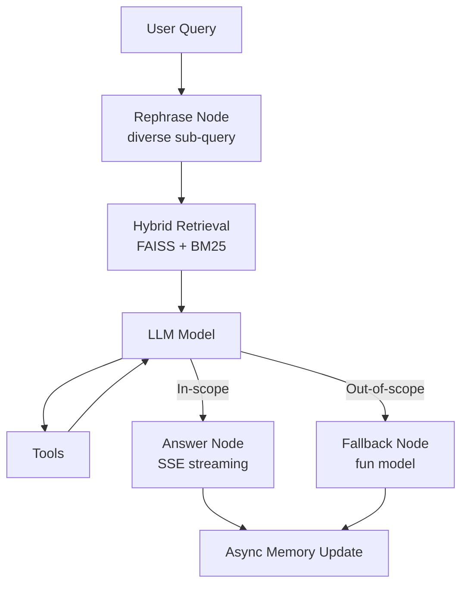

# Krishna AI Agent — LangGraph RAG Chatbot (FastAPI + React)

A production-ready, streaming chatbot that answers questions about **Krishna Vamsi Dhulipalla**. The agent uses a **LangGraph-based RAG pipeline** (hybrid retrieval with FAISS + BM25), streams tokens via **Server-Sent Events (SSE)**, and provides a minimal **ChatGPT-style UI** in React/TypeScript.

> **Highlights**
> - **LangGraph Agent:** modular nodes for rephrasing, retrieval, validation, answering, fallback, and memory update  
> - **Hybrid Retrieval:** FAISS vectors + keyword (BM25) for robust recall  
> - **Live Streaming:** assistant responses stream token-by-token via SSE  
> - **Tools:** Google Calendar meeting scheduling + (pluggable) resume download and custom tools  
> - **Dockerized:** single `Dockerfile` for backend & UI  
> - **Observability (WIP):** LangSmith hooks are scaffolded for future tracing

---

## Table of Contents

- [Architecture & Flow](#architecture--flow)
- [Directory Structure](#directory-structure)
- [Features](#features)
- [Setup](#setup)
  - [Prerequisites](#prerequisites)
  - [Environment Variables](#environment-variables)
  - [Install & Run (Local Dev)](#install--run-local-dev)
  - [Vector Store Creation](#vector-store-creation)
  - [Docker](#docker)
- [API](#api)
- [Frontend (React UI)](#frontend-react-ui)
- [Troubleshooting](#troubleshooting)
- [Roadmap / Future Enhancements](#roadmap--future-enhancements)
- [Contributing](#contributing)

---

## Architecture & Flow



## Directory Structure

```
repo-root/
├─ backend/
│  ├─ __init__.py
│  ├─ agent.py                # LangGraph agent: nodes, state, routing
│  ├─ api.py                  # FastAPI app, SSE /chat, health, tools wiring
│  ├─ calendar_setup.py       # Google Calendar OAuth + calendar helpers
│  ├─ data/                   # raw and processed data (embeddings, faiss)
│  ├─ assets/                 # static prompt templates, system msgs, etc.
│  └─ vectorstoring.py        # raw -> embeddings -> FAISS index pipeline
│
├─ ui/
│  ├─ dist/                   # production build output
│  └─ src/
│     ├─ messages.ts          # message model/types & helpers
│     ├─ threads.ts           # thread list, create/delete/clear, local cache
│     ├─ useChat.tsx          # chat hook: SSE, state, streaming
│     ├─ App.tsx              # Chat UI (ChatGPT-style dark theme)
│     └─ (other React files)  # components, styles, icons, etc.
│
├─ Dockerfile
├─ .env.example
├─ requirements.txt
└─ README.md
```

> Paths may differ slightly in your local repo; the core files above map to the code you’re using.

---

## Features

- **RAG with Hybrid Retrieval**: combine vector and keyword search for accuracy.
- **LangGraph Agent**: explicit state passing across nodes, clear branching.
- **Tool Use**: Google Calendar schedule/modify/cancel; resume download; extendable tool registry.
- **Streaming UX**: markdown render, code blocks, copy buttons, typing dots during “thinking.”
- **Threaded History**: multiple conversations with local persistence.
- **Docker**: containerized app for easy deploy.
- **Observability (WIP)**: LangSmith hooks scaffolded for traces & evals.

---

## Setup

### Prerequisites

- **Python 3.10+**
- **Node 18+** and **pnpm**/**npm**/**yarn** (choose one)
- **FAISS** CPU (installed via pip)  
- Accounts/keys for your LLM provider (e.g., OpenAI, NVIDIA, etc.)
- (Optional) **Google Calendar** credentials for scheduling

### Environment Variables

Create `.env` in the repo root (copy from `.env.example`):

```bash
# LLM
LLM_PROVIDER=openai              # or nvidia, azure, etc.
OPENAI_API_KEY=sk-...            # if using OpenAI

# Retrieval
EMBEDDING_MODEL=text-embedding-3-small
VECTOR_STORE_DIR=backend/data/faiss
DOCS_DIR=backend/data/raw

# Server
HOST=0.0.0.0
PORT=8080

# Google Calendar (optional tool)
GOOGLE_CLIENT_SECRET_JSON=cred/client_secret.json
GOOGLE_TOKEN_JSON=cred/token.json
GOOGLE_CALENDAR_ID=primary      # or your calendar id
```

> If you deploy to Hugging Face or another PaaS, mount the `cred/` folder as a **secret** or use env secrets and generate tokens at startup.

### Install & Run (Local Dev)

**Backend**

```bash
python -m venv .venv && source .venv/bin/activate  # Windows: .venv\Scripts\activate
pip install -r requirements.txt

# Run FastAPI
uvicorn backend.api:api --reload --host 0.0.0.0 --port 8080
```

**Frontend**

```bash
cd ui
npm install         # or pnpm i / yarn
npm run build

npm run dev         # For testing UI
```

By default the UI expects the backend at `http://localhost:8080`. Adjust the base URL in `useChat.tsx` if needed.

### Vector Store Creation

Use **`backend/vectorstoring.py`** to build FAISS from your raw docs:

```bash
# 1) Put your source files in backend/data/raw
# 2) Run the indexer
python backend/vectorstoring.py   --docs_dir backend/data/raw   --out_dir backend/data/faiss   --embedding_model text-embedding-3-small
```

This script will:
- Chunk documents
- Create embeddings
- Build a FAISS index + metadata files under `backend/data/faiss`

> Re-run this step any time you change source docs.

### Docker

Build and run:

```bash
# Build
docker build -t krishna-agent .

# Run (maps port 8080 and mounts creds if needed)
docker run --rm -p 8080:8080   --env-file .env   -v $(pwd)/cred:/app/cred   -v $(pwd)/backend/data:/app/backend/data   krishna-agent
```

If you host the UI separately, make sure it points to the container URL for `/chat` requests.

---

## API

- `GET /health` → `{ status: "ok" }`
- `GET /chat?thread_id=...&message=...` → **SSE stream**
  - Events:
    - `token` — individual token chunks
    - `done` — stream completion
- Tool endpoints (examples):
  - `GET /resume/download` — returns a downloadable resume URL
  - Calendar helpers (`/meeting/create`, `/meeting/update`, `/meeting/delete`) depending on your wiring in `api.py`

> See `backend/api.py` for exact names; the UI `useChat.tsx` only relies on `/chat`.

---

## Frontend (React UI)

- **`useChat.tsx`**
  - Keeps **per-thread** messages in local storage.
  - Opens **EventSource** to `/chat`, appends incoming `token` events to the last assistant message.
  - Exposes `isStreaming` and `hasFirstToken` to drive the typing indicator.
- **`App.tsx`**
  - Renders chat bubbles as ChatGPT-like UI (dark theme).
  - Suggestion buttons for quick prompts.
  - Typing dots show during “thinking” (before first token).

> If you change backend origin, update the UI fetch base in `useChat.tsx`.

---

## Troubleshooting

- **White/blank box during thinking**: the thinking row should render as a light inline element. If you see a big block, ensure it’s not styled as a full bubble (remove background/border/padding) and that no empty assistant message is pre-appended.
- **SSE not streaming**:
  - Check browser console for `EventSource` errors.
  - Confirm CORS and that `/chat` responds with `text/event-stream`.
  - Verify reverse proxies (nginx, HF Spaces) don’t buffer responses.
- **Google Calendar `invalid_scope`**:
  - Match scopes in `calendar_setup.py` and Google console.
  - Delete `cred/token.json` and re-consent if scopes changed.

---

## Roadmap / Future Enhancements

- **LangSmith integration** for tracing, dataset runs, eval harness
- **More tools**:
  - File Q&A (upload docs on the fly)
  - Email/Slack helpers
  - Retrieval from cloud KBs (Drive, Notion)
- **Auth & Multi-user** session management
- **Serverless** deploy presets (Hugging Face, Fly, Render)
- **GPU**-backed embeddings & rerankers
- **Tests & CI/CD** (lint, typecheck, e2e)

---

## Contributing

1. Fork the repo & create a feature branch
2. Make your changes with tests where applicable
3. Open a PR with context and screenshots

---

## License

Apache License © 2025 Krishna Vamsi Dhulipalla
