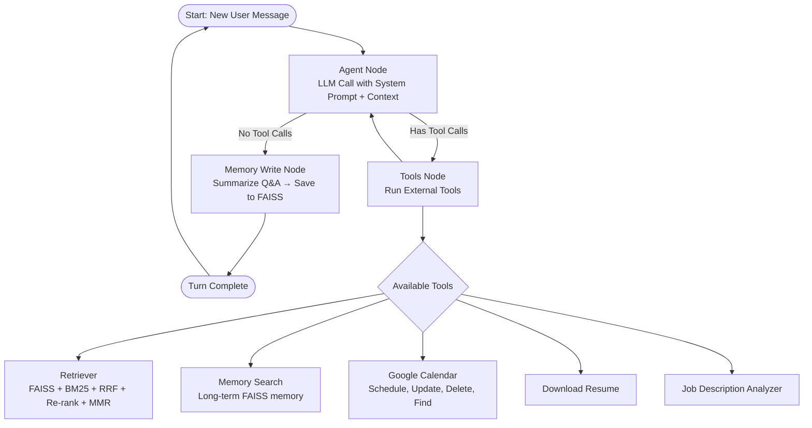

# Krishna AI Agent — LangGraph RAG Chatbot (FastAPI + React)

A production-ready, streaming chatbot that answers questions about **Krishna Vamsi Dhulipalla**.  
The system is built as a **data → retrieval/inference → serving** pipeline with a focus on:

- Clear **architecture** (LangGraph DAG over a RAG stack)
- **Production concerns** (latency / cost budgets, observability hooks)
- **Cloud-native deployment** (Docker, env-based config)
- **MLOps awareness** (evals, debugging, and iteration notes)

> **Highlights**
> - **LangGraph Agent:** modular nodes for rephrasing, retrieval, validation, answering, fallback, and memory update  
> - **Hybrid Retrieval:** FAISS vectors + keyword (BM25) for robust recall  
> - **Live Streaming:** assistant responses stream token-by-token via SSE  
> - **Tools:** Google Calendar meeting scheduling + (pluggable) resume download and custom tools  
> - **Dockerized:** single `Dockerfile` for backend & UI  
> - **Observability-Ready:** LangSmith hooks scaffolded for tracing and evaluation runs

---

## Table of Contents

- [Architecture & Flow](#architecture--flow)
- [Production Readiness & Metrics](#production-readiness--metrics)
- [Deployment & Cloud Infrastructure](#deployment--cloud-infrastructure)
- [Directory Structure](#directory-structure)
- [Features](#features)
- [Setup](#setup)
  - [Prerequisites](#prerequisites)
  - [Environment Variables](#environment-variables)
  - [Install & Run (Local Dev)](#install--run-local-dev)
  - [Vector Store Creation](#vector-store-creation)
  - [Docker](#docker)
- [API](#api)
- [Frontend (React UI)](#frontend-react-ui)
- [Troubleshooting & Postmortems](#troubleshooting--postmortems)
- [Roadmap / Future Enhancements](#roadmap--future-enhancements)
- [Contributing](#contributing)
- [License](#license)

---

## Architecture & Flow

At a high level, the system follows this path:

1. **Data layer** – Source files → embeddings → FAISS index (plus BM25 keyword index)
2. **Retrieval layer** – Hybrid retrieval (vectors + keywords) + reranking
3. **Inference / Orchestration** – LangGraph agent coordinates tools, memory, and LLM calls
4. **Serving layer** – FastAPI backend exposes `/chat` as a streaming SSE endpoint
5. **UI layer** – React app renders a ChatGPT-style multi-thread chat interface



---

## Production Readiness & Metrics

This project doubles as a **portfolio piece** for how I think about running LLM-backed systems in production.

### Latency, Cost, and SLOs

The system is structured around explicit budgets per request:

- **Target p95 latency budget** (end-to-end):  
  - Retrieval (FAISS + BM25 + rerank): _hundreds of ms_  
  - LLM completion: _dominant share of latency_  
  - App overhead (JSON parsing, SSE framing, logging): _small, bounded portion_
- **Levers to stay within budget**:
  - Limit max tokens for completion and context size
  - Control number of retrieved chunks and rerank depth
  - Prefer cheaper models for light queries; switch to stronger ones only when needed

To make this actionable in a real deployment, I recommend:

- Wrapping the LLM client with a small **latency & cost logging middleware** (logging tokens in/out and per-request cost)
- Exporting these metrics to a backend of your choice (CloudWatch, Prometheus, Stackdriver, etc.)
- Defining basic SLOs, e.g. _“95% of requests complete under X seconds; error rate below Y% over Z minutes”_

> The code is structured so these hooks can be added cleanly at the API and LangGraph edges without changing the core agent logic.

### Evaluation & Retrieval Quality

Quality is driven by both retrieval and generation. The design assumes:

- **Offline evaluation**: use LangSmith (or similar) datasets to run evals across:
  - Retrieval quality (hit@k, MRR, top-k doc correctness)
  - Answer quality (graded by an LLM with task-specific rubrics)
- **Online evaluation**:
  - Basic logging of queries, retrieved docs, and final answers
  - Ability to replay conversations with new prompts/models

The `Roadmap` section calls out **LangSmith integration** and a more formal eval harness as future work.

### Reliability & Failure Modes

Common failure modes and mitigations:

- **LLM/tool errors** → defensive guards around tool calls with clear error messages
- **Partial or empty retrieval** → fallback to profile-level context or explain limitations
- **Streaming interruptions** → SSE-specific checks and proxy configuration tips (see [Troubleshooting](#troubleshooting--postmortems))

These are documented with concrete, reproducible steps so the system can be debugged quickly when something breaks.

---

## Deployment & Cloud Infrastructure

The app is intentionally **cloud-agnostic** but designed to deploy cleanly to providers like AWS, GCP, or Azure.

Typical production setup:

- **Runtime**
  - `FastAPI` + `uvicorn` backend in a **Docker** image
  - React/TypeScript UI served via:
    - Static hosting (S3 + CloudFront, GCS + CDN, or similar), or
    - The same container (for smaller deployments)
- **Network / Serving**
  - Load balancer or API gateway terminating TLS
  - Backend exposed as a stateless HTTP service with `/chat` using SSE
- **State & Storage**
  - **FAISS** index stored on attached disk or a mounted volume
  - Optionally swap FAISS for a managed vector DB (pgvector, Pinecone, Qdrant) without changing the core LangGraph logic
- **Secrets & Config**
  - All secrets via env vars (LLM keys, Google credentials, etc.)
  - No credentials are hardcoded into the repo
---

## Directory Structure

```text
repo-root/
├─ backend/
│  ├─ __init__.py
│  ├─ agent.py                # LangGraph agent: nodes, state, routing
│  ├─ api.py                  # FastAPI app, SSE /chat, health, tools wiring
│  ├─ calendar_setup.py       # Google Calendar OAuth + calendar helpers
│  ├─ data/                   # raw and processed data (embeddings, faiss)
│  ├─ assets/                 # static prompt templates, system msgs, etc.
│  └─ vectorstoring.py        # raw -> embeddings -> FAISS index pipeline
│
├─ ui/
│  ├─ dist/                   # production build output
│  └─ src/
│     ├─ messages.ts          # message model/types & helpers
│     ├─ threads.ts           # thread list, create/delete/clear, local cache
│     ├─ useChat.tsx          # chat hook: SSE, state, streaming
│     ├─ App.tsx              # Chat UI (ChatGPT-style dark theme)
│     └─ (other React files)  # components, styles, icons, etc.
│
├─ Dockerfile
├─ .env.example
├─ requirements.txt
└─ README.md
```

---

## Features

- **RAG with Hybrid Retrieval**
  - FAISS vector search and BM25 keyword search combined for better recall and precision.
- **LangGraph Agent**
  - Explicit stateful graph with nodes for retrieval, answer synthesis, validation, and memory updates.
- **Tool Use**
  - Google Calendar (schedule / modify / cancel)
  - Resume download
  - Additional tools can be plugged in via the LangGraph tool registry.
- **Streaming UX**
  - SSE-based token streaming from FastAPI to the React client.
  - Markdown rendering with code blocks and copy-to-clipboard.
  - Typing indicator during “thinking” and streaming.
- **Threaded History**
  - Multiple conversations with local persistence in the browser.
- **Docker**
  - Single Dockerfile for backend + UI for reproducible builds.
- **Observability Hooks**
  - LangSmith integration points and clear seams for logging/metrics/traces.

---

## Setup

### Prerequisites

- **Python 3.10+**
- **Node 18+** and a package manager (**pnpm** / **npm** / **yarn**)
- **FAISS** CPU (installed via pip)  
- Accounts/keys for your LLM provider (e.g., OpenAI, NVIDIA, etc.)
- (Optional) **Google Calendar** credentials for scheduling

### Environment Variables

Create `.env` in the repo root (copy from `.env.example`):

```bash
# LLM
LLM_PROVIDER=openai              # or nvidia, azure, etc.
OPENAI_API_KEY=sk-...            # if using OpenAI

# Retrieval
EMBEDDING_MODEL=text-embedding-3-small
VECTOR_STORE_DIR=backend/data/faiss
DOCS_DIR=backend/data/raw

# Server
HOST=0.0.0.0
PORT=8080

# Google Calendar (optional tool)
GOOGLE_CLIENT_SECRET_JSON=cred/client_secret.json
GOOGLE_TOKEN_JSON=cred/token.json
GOOGLE_CALENDAR_ID=primary      # or your calendar id
```

> In hosted environments (Hugging Face Spaces, Render, etc.), keep `cred/` as a secret mount or generate tokens at startup using env-based credentials.

### Install & Run (Local Dev)

**Backend**

```bash
python -m venv .venv && source .venv/bin/activate  # Windows: .venv\Scripts\activate
pip install -r requirements.txt

# Run FastAPI
uvicorn backend.api:api --reload --host 0.0.0.0 --port 8080
```

**Frontend**

```bash
cd ui
npm install         # or pnpm i / yarn
npm run build       # ensure the app builds

npm run dev         # run the dev server for the UI
```

By default the UI expects the backend at `http://localhost:8080`. Update the base URL in `useChat.tsx` if your backend runs elsewhere.

### Vector Store Creation

Use **`backend/vectorstoring.py`** to build FAISS from your raw docs:

```bash
# 1) Put your source files in backend/data/raw
# 2) Run the indexer
python backend/vectorstoring.py \
  --docs_dir backend/data/raw \
  --out_dir backend/data/faiss \
  --embedding_model text-embedding-3-small
```

This script will:

- Chunk documents
- Create embeddings
- Build a FAISS index + metadata files under `backend/data/faiss`

Re-run this step any time you change source docs.

### Docker

Build and run:

```bash
# Build
docker build -t krishna-agent .

# Run (maps port 8080 and mounts creds if needed)
docker run --rm -p 8080:8080 \
  --env-file .env \
  -v $(pwd)/cred:/app/cred \
  -v $(pwd)/backend/data:/app/backend/data \
  krishna-agent
```

If you host the UI separately, make sure it points to the container URL for `/chat` requests.

---

## API

- `GET /health` → `{ "status": "ok" }`
- `GET /chat?thread_id=...&message=...` → **SSE stream**
  - Events:
    - `token` — individual token chunks
    - `done` — stream completion
- Tool endpoints (examples, depending on your wiring in `api.py`):
  - `GET /resume/download` — returns a downloadable resume URL
  - Calendar helpers (`/meeting/create`, `/meeting/update`, `/meeting/delete`)

The React client only relies on `/chat`; tools are triggered by the agent internally.

---

## Frontend (React UI)

Key files:

- **`useChat.tsx`**
  - Manages per-thread messages and local storage.
  - Opens an `EventSource` to `/chat` and appends incoming `token` events.
  - Exposes `isStreaming` and `hasFirstToken` flags to drive the typing indicator.
- **`App.tsx`**
  - Renders chat bubbles in a ChatGPT-like dark theme.
  - Provides suggestion buttons for quick prompts.
  - Shows a thinking/typing row before the first token arrives.

If you change the backend origin, update the base URL used in `useChat.tsx`.

---

## Troubleshooting & Postmortems

### Common Issues

- **White or blank box during thinking**
  - The thinking row should render as a small inline element.
  - If you see a large bubble, ensure it isn’t styled as a full chat message (remove background/border/padding) and that you aren’t pre-appending an empty assistant message.

- **SSE not streaming / tokens arrive all at once**
  - Check the browser console for `EventSource` errors.
  - Confirm the backend sets `Content-Type: text/event-stream` and `Cache-Control: no-cache`.
  - Make sure reverse proxies (nginx, HF Spaces, etc.) are not buffering the stream.

- **Google Calendar `invalid_scope` errors**
  - Scopes in `calendar_setup.py` must match those in the Google Cloud console.
  - Delete `cred/token.json` and re-consent if scopes change.

### Example Postmortem: SSE Stream Buffering Behind Proxy

**Symptom**  
In a proxy-backed deployment, users saw no tokens for several seconds and then the entire answer appeared at once.

**Analysis**  

- SSE endpoint was working locally (tokens streamed correctly).
- Behind a reverse proxy, responses accumulated until the stream closed.

**Root Cause**  

- The reverse proxy was buffering `text/event-stream` responses by default, defeating streaming semantics.

**Fix**  

- Disabled proxy buffering for the SSE endpoint (e.g., `proxy_buffering off;` in nginx for `/chat`).
- Verified that `uvicorn` was using `--timeout-keep-alive` appropriate for long-running connections.
- Added notes to this README so future deployments set these options correctly the first time.

This is the kind of real-world issue that shows up only once you integrate LLM services with production networking stacks, and the README documents the reasoning and fix path.

---

## Contributing

1. Fork the repo and create a feature branch.
2. Make your changes with tests where applicable.
3. Open a PR with context and, where relevant, screenshots or logs.

---

## License

Apache License © 2025 Krishna Vamsi Dhulipalla
