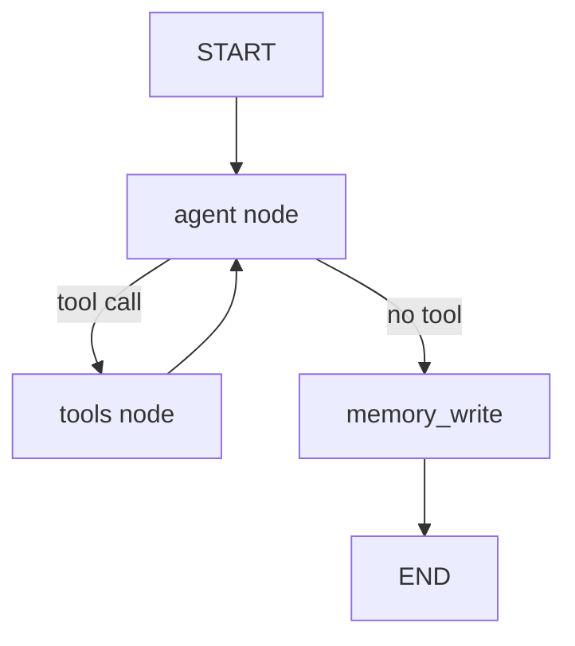

# 🤖 Chatbot Architecture Overview: Krishna's Personal AI Assistant (old and intial one)

This document outlines the technical architecture and modular design of Krishna Vamsi Dhulipalla’s personal AI chatbot system, implemented using **LangChain**, **OpenAI**, **NVIDIA NIMs**, and **Gradio**. The assistant is built for intelligent, retriever-augmented, memory-aware interaction tailored to Krishna’s background and user context.

---

## 🧱 Core Components

### 1. **LLMs Used and Their Roles**

| Purpose                             | Model Name                               | Role Description                                                 |
| ----------------------------------- | ---------------------------------------- | ---------------------------------------------------------------- |
| **Rephraser LLM**                   | `microsoft/phi-3-mini-4k-instruct`       | Rewrites vague/short queries into detailed, keyword-rich queries |
| **Relevance Classifier + Reranker** | `mistralai/mixtral-8x22b-instruct-v0.1`  | Classifies query relevance to KB and reranks retrieved chunks    |
| **Answer Generator**                | `nvidia/llama-3.1-nemotron-70b-instruct` | Provides rich, structured answers (replacing GPT-4o for testing) |
| **Fallback Humor Model**            | `mistralai/mixtral-8x22b-instruct-v0.1`  | Responds humorously and redirects when out-of-scope              |
| **KnowledgeBase Updater**           | `mistralai/mistral-7b-instruct-v0.3`     | Extracts and updates structured memory about the user            |

All models are integrated via **LangChain RunnableChains**, supporting both streaming and structured execution.

---

## 🔍 Retrieval Architecture

### ✅ **Hybrid Retrieval System**

The assistant combines:

- **BM25Retriever**: Lexical keyword match
- **FAISS Vector Search**: Dense embeddings from `sentence-transformers/all-MiniLM-L6-v2`

### 🧠 Rephrasing for Retrieval

- The **user's query** is expanded using the Rephraser LLM, with awareness of `last_followups` and memory
- **Rewritten query** is used throughout retrieval, validation, and reranking

### 📊 Scoring & Ranking

- Each subquery is run through both BM25 and FAISS
- Results are merged via weighted formula:  
  `final_score = α * vector_score + (1 - α) * bm25_score`
- Deduplication via fingerprinting
- Top-k (default: 15) results are passed forward

---

## 🔎 Validation + Chunk Reranking

### 🔍 Relevance Classification

- LLM2 evaluates:
  - Whether the query (or rewritten query) is **in-scope**
  - If so, returns a **reranked list of chunk indices**
- Memory (`last_input`, `last_output`, `last_followups`) and `rewritten_query` are included for better context

### ❌ If Out-of-Scope

- Chunks are discarded
- Response is generated using fallback LLM with humor and redirection

---

## 🧠 Memory + Personalization

### 📘 KnowledgeBase Model

Tracks structured user data:

- `user_name`, `company`, `last_input`, `last_output`
- `summary_history`, `recent_interests`, `last_followups`, `tone`

### 🔄 Memory Updates

- After every response, assistant extracts and updates memory
- Handled via `RExtract` pipeline using `PydanticOutputParser` and KB LLM

---

## 🧭 Orchestration Flow

```text
User Input
   ↓
Rephraser LLM (phi-3-mini)
   ↓
Hybrid Retrieval (BM25 + FAISS)
   ↓
Validation + Reranking (mixtral-8x22b)
   ↓
 ┌──────────────┐     ┌────────────────────┐
 │ In-Scope     │     │ Out-of-Scope Query │
 │ (Top-k Chunks)│     │ (Memory-based only)│
 └────┬─────────┘     └─────────────┬──────┘
      ↓                                  ↓
 Answer LLM (nemotron-70b)       Fallback Humor LLM
```

---

## 💬 Frontend Interface (Gradio)

- Built using **Gradio ChatInterface + Blocks**
- Features:
  - Responsive design
  - Custom CSS
  - Streaming markdown responses
  - Preloaded examples and auto-scroll

---

## 🧩 Additional Design Highlights

- **Streaming**: Nemotron-70B used via LangChain streaming
- **Prompt Engineering**: Answer prompts use markdown formatting, section headers, bullet points, and personalized sign-offs
- **Memory-Aware Rewriting**: Handles vague replies like `"yes"` or `"A"` by mapping them to `last_followups`
- **Knowledge Chunk Enrichment**: Each FAISS chunk includes synthetic summary and 3 QA-style synthetic queries

---

## 🚀 Future Enhancements

- Tool calling for tasks like calendar access or Google search
- Multi-model reranking agents
- Memory summarization agents for long dialogs
- Topic planners to group conversations
- Retrieval filtering based on user interest and session

---

This architecture is modular, extensible, and designed to simulate a memory-grounded, expert-aware personal assistant tailored to Krishna’s evolving knowledge and conversational goals.

# 🤖 Chatbot Architecture Overview: Krishna's Personal AI Assistant (LangGraph Version) (New and current one)

This document details the updated architecture of **Krishna Vamsi Dhulipalla’s** personal AI assistant, now fully implemented with **LangGraph** for orchestrated state management and tool execution. The system is designed for **retrieval-augmented, memory-grounded, and multi-turn conversational intelligence**, integrating **OpenAI GPT-4o**, **Hugging Face embeddings**, and **cross-encoder reranking**.

---

## 🧱 Core Components

### 1. **Models & Their Roles**

| Purpose                    | Model Name                               | Role Description                                 |
| -------------------------- | ---------------------------------------- | ------------------------------------------------ |
| **Main Chat Model**        | `gpt-4o`                                 | Handles conversation, tool calls, and reasoning  |
| **Retriever Embeddings**   | `sentence-transformers/all-MiniLM-L6-v2` | Embedding generation for FAISS vector search     |
| **Cross-Encoder Reranker** | `cross-encoder/ms-marco-MiniLM-L-6-v2`   | Reranks retrieval results for semantic relevance |
| **BM25 Retriever**         | (LangChain BM25Retriever)                | Keyword-based search complementing vector search |

All models are bound to LangGraph **StateGraph** nodes for structured execution.

---

## 🔍 Retrieval System

### ✅ **Hybrid Retrieval**

- **FAISS Vector Search** with normalized embeddings
- **BM25Retriever** for lexical keyword matching
- Combined using **Reciprocal Rank Fusion (RRF)**

### 📊 **Reranking & Diversity**

1. Initial retrieval with FAISS & BM25 (top-K per retriever)
2. Fusion via RRF scoring
3. **Cross-Encoder reranking** (top-N candidates)
4. **Maximal Marginal Relevance (MMR)** selection for diversity

### 🔎 Retriever Tool (`@tool retriever`)

- Returns top passages with minimal duplication
- Used in-system prompt to fetch accurate facts about Krishna

---

## 🧠 Memory System

### Long-Term Memory

- **FAISS-based memory vector store** stored at `backend/data/memory_faiss`
- Stores conversation summaries per thread ID

### Memory Search Tool (`@tool memory_search`)

- Retrieves relevant conversation snippets by semantic similarity
- Supports **thread-scoped** search for contextual continuity

### Memory Write Node

- After each AI response, stores `[Q]: ... [A]: ...` summary
- Autosaves after every `MEM_AUTOSAVE_EVERY` turns or on thread end

---

## 🧭 Orchestration Flow (LangGraph)



### **Nodes**:

- **agent**: Calls main LLM with conversation window + system prompt
- **tools**: Executes retriever or memory search tools
- **memory_write**: Persists summaries to long-term memory

### **Conditional Edges**:

- From **agent** → `tools` if tool call detected
- From **agent** → `memory_write` if no tool call

---

## 💬 System Prompt

The assistant:

- Uses retriever and memory search tools to gather facts about Krishna
- Avoids fabrication and requests clarification when needed
- Responds humorously when off-topic but steers back to Krishna’s expertise
- Formats with Markdown, headings, and bullet points

Embedded **Krishna’s Bio** provides static grounding context.

---

## 🌐 API & Streaming

- **Backend**: FastAPI (`backend/api.py`)
  - `/chat` SSE endpoint streams tokens in real-time
  - Passes `thread_id` & `is_final` to LangGraph for stateful conversations
- **Frontend**: React + Tailwind (custom chat UI)
  - Threaded conversation storage in browser `localStorage`
  - Real-time token rendering via `EventSource`
  - Features: new chat, clear chat, delete thread, suggestions

---

## 🖥️ Frontend Highlights

- Dark theme ChatGPT-style UI
- Sidebar for thread management
- Live streaming responses with Markdown rendering
- Suggestion prompts for quick interactions
- Message actions: copy, edit, regenerate

---

## 🧩 Design Improvements Over Previous Version

- **LangGraph StateGraph** ensures explicit control of message flow
- **Thread-scoped memory** enables multi-session personalization
- **Hybrid RRF + Cross-Encoder + MMR** retrieval pipeline improves relevance & diversity
- **SSE streaming** for low-latency feedback
- Decoupled **retrieval** and **memory** as separate tools for modularity

---

## 🚀 Future Enhancements

- Integrate **tool calling** for external APIs (calendar, search)
- Summarization agents for condensing memory store
- Interest-based retrieval filtering
- Multi-agent orchestration for complex tasks

---

This LangGraph-powered architecture delivers a **stateful, retrieval-augmented, memory-aware personal assistant** optimized for Krishna’s profile and designed for **extensibility, performance, and precision**.
